# WAMRViT

Adaptive Vision Transformer with quadtree-based adaptive patching for scientific spatiotemporal forecasting. Refines high-gradient regions, coarsens smooth ones.

## Visualization

### AMR

<table>
  <tr>
    <th></th>
    <th align="center">Model prediction</th>
    <th align="center">Ground truth</th>
  </tr>
  <tr>
    <th>HRR</th>
    <td></td>
    <td>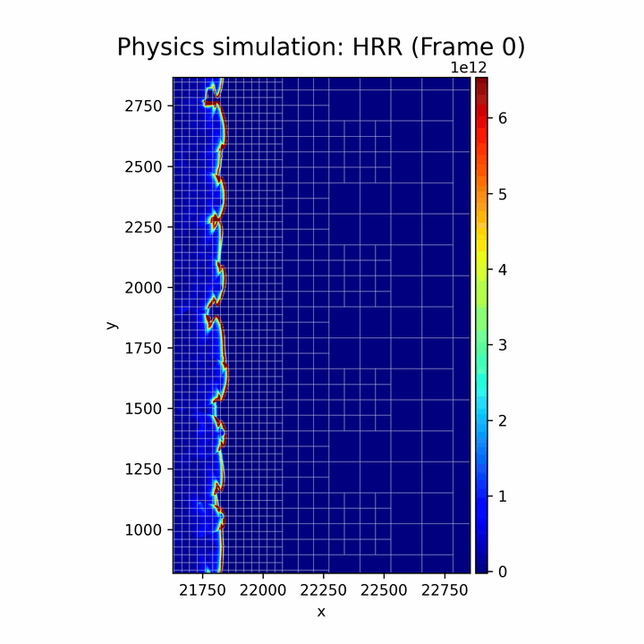</td>
  </tr>
  <tr>
    <th>Pressure</th>
    <td></td>
    <td></td>
  </tr>
  <tr>
    <th>Density (ρ)</th>
    <td>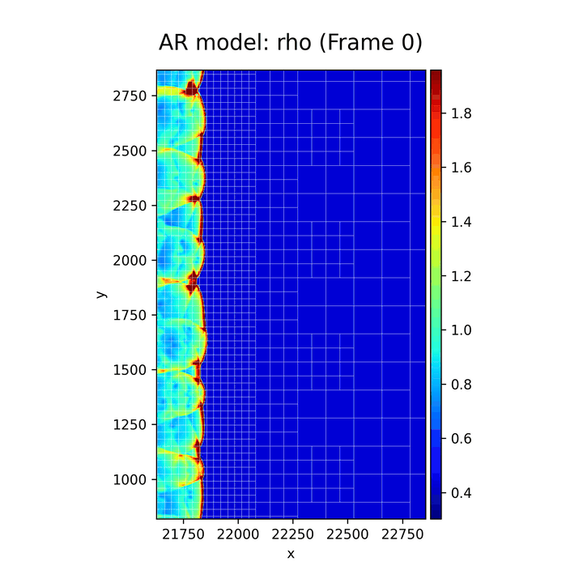</td>
    <td>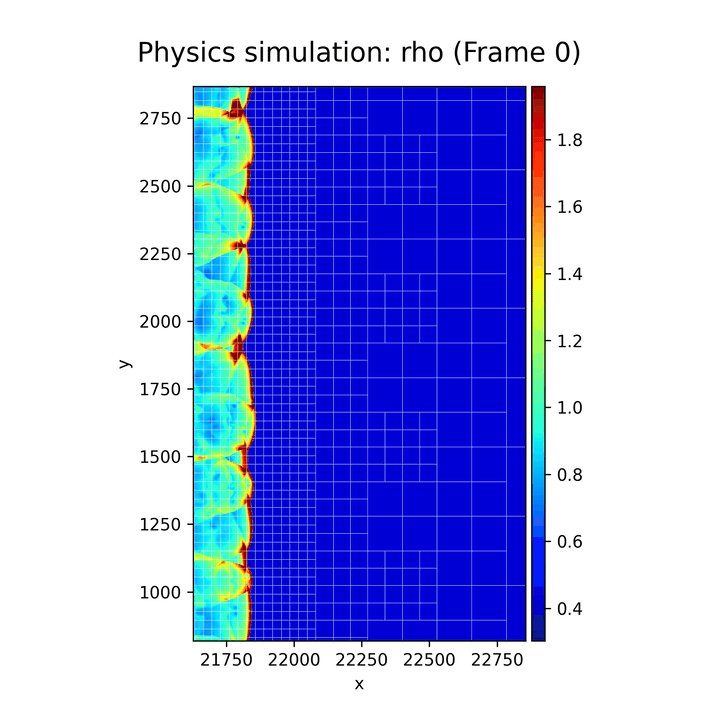</td>
  </tr>
  <tr>
    <th>Temperature</th>
    <td></td>
    <td></td>
  </tr>
</table>

Combustion trajectory, frame 330. Each row pairs the model's prediction with the ground truth at matching resolution.

### PLI

<table width="100%">
  <tr>
    <th width="33.33%" align="center">Ground truth</th>
    <th width="33.33%" align="center">WAMRViT (adaptive)</th>
    <th width="33.33%" align="center">WAMRViT (multi-scale)</th>
  </tr>
  <tr>
    <td>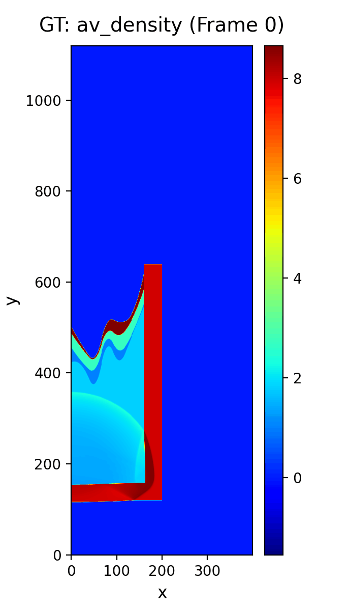</td>
    <td>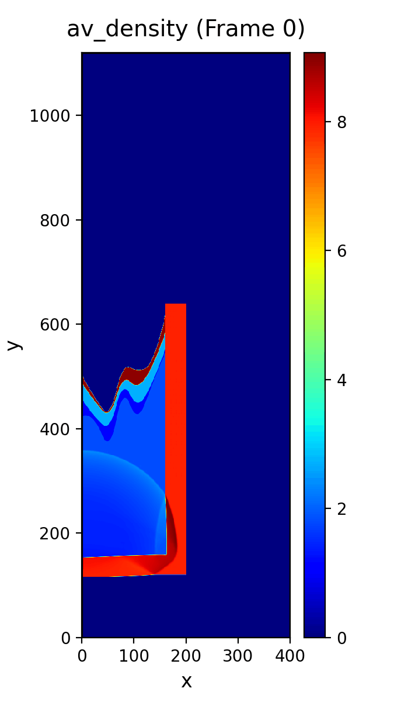</td>
    <td></td>
  </tr>
  <tr>
    <th width="33.33%" align="center">ViT (finest)</th>
    <th width="33.33%" align="center">ViT (mid)</th>
    <th width="33.33%" align="center">SwinV2</th>
  </tr>
  <tr>
    <td></td>
    <td>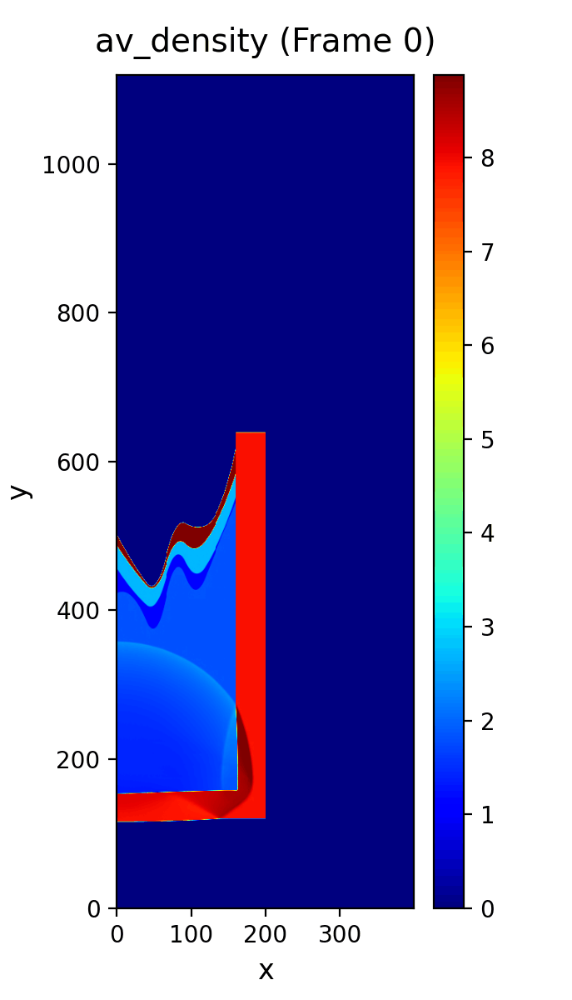</td>
    <td>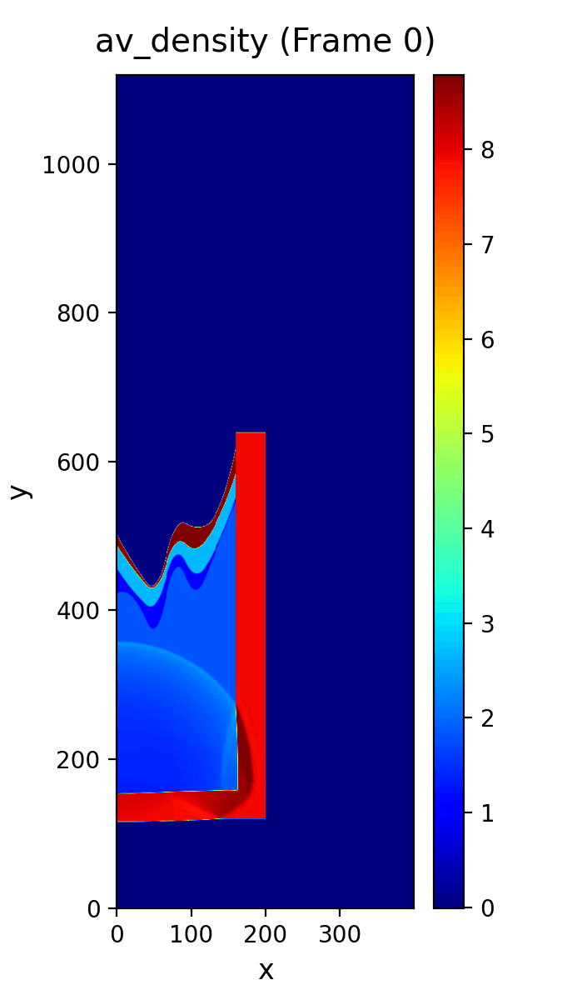</td>
  </tr>
</table>

av_density, PLI trajectory 951, starting frame 20. 1120 × 400. Top row: ground truth and the two adaptive WAMRViT variants; bottom row: the three regular-grid baselines.

### TRL

<table width="100%">
  <tr><th align="center">Ground truth</th></tr>
  <tr><td>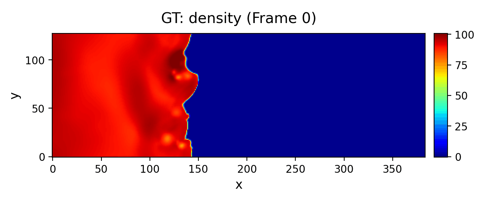</td></tr>
  <tr><th align="center">WAMRViT (adaptive)</th></tr>
  <tr><td>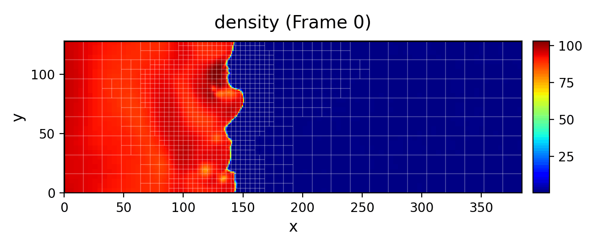</td></tr>
  <tr><th align="center">WAMRViT (multi-scale)</th></tr>
  <tr><td>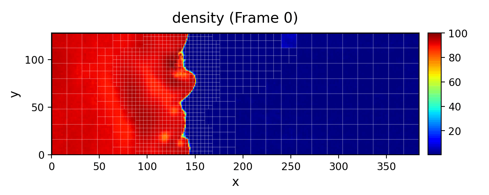</td></tr>
  <tr><th align="center">ViT (finest)</th></tr>
  <tr><td>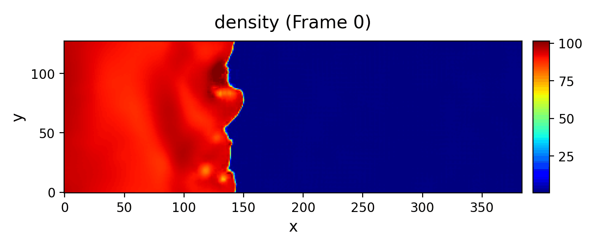</td></tr>
  <tr><th align="center">ViT (mid)</th></tr>
  <tr><td></td></tr>
  <tr><th align="center">SwinV2</th></tr>
  <tr><td></td></tr>
</table>

Density field, TRL (turbulent radiative layer) trajectory 0, frame 20. 128 × 384. The adaptive variants overlay the quadtree mesh. 

---

## Install

```bash
uv sync
uv pip install -e .
```

Python ≥ 3.12.

## Status

Code-only release: configuration files, normalization data, and example
commands are not included in this revision.

## Layout

```
train.py                    Training entry point (Ray Tune + DDP)
wamrvit/
├── quadtree_transformer.py Adaptive quadtree ViT
├── swin_transformer.py     Regular-grid SwinV2 baseline
├── quad/                   Quadtree primitives and adaptation
├── dataloader/             Data loading, topology caching
├── rollout/                Autoregressive rollout, metrics
└── visualization/          Plotting utilities
```
