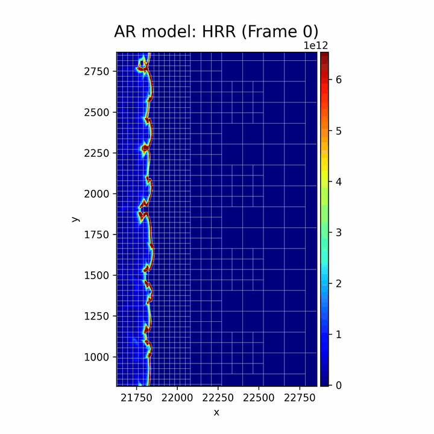
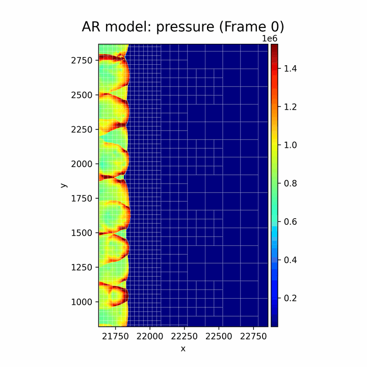
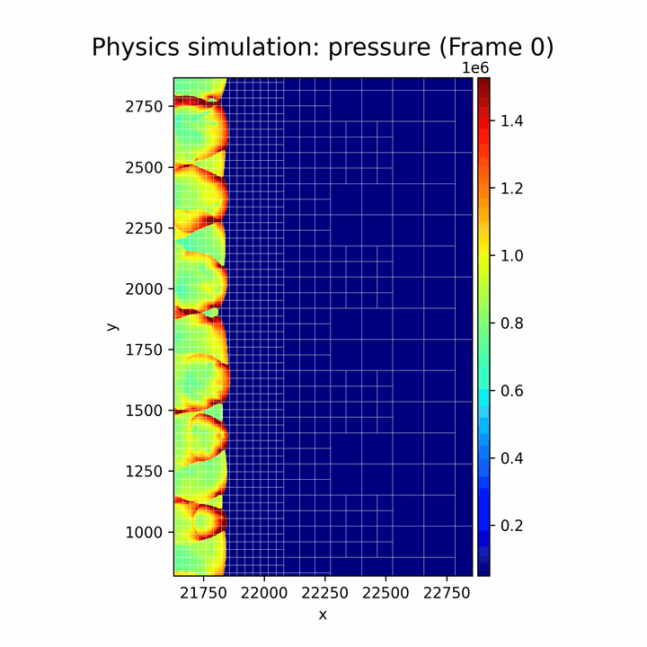
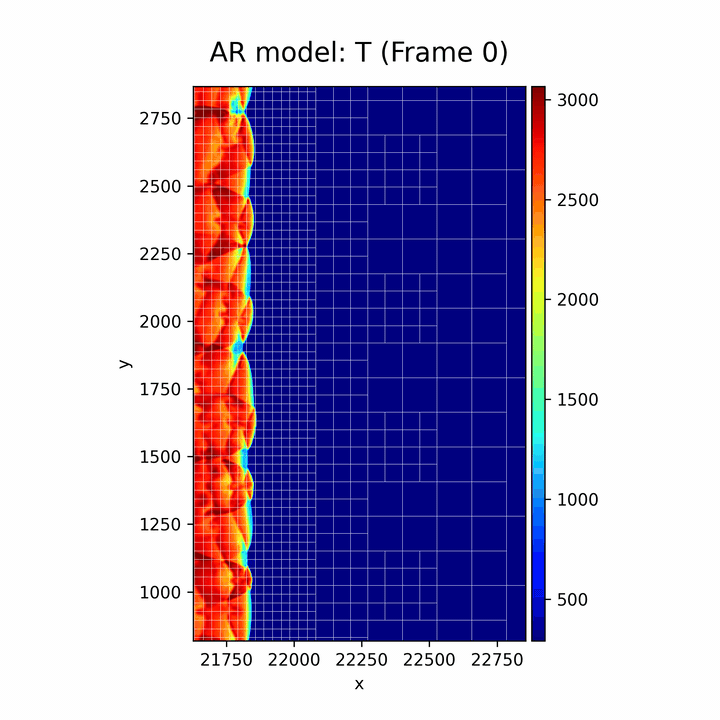
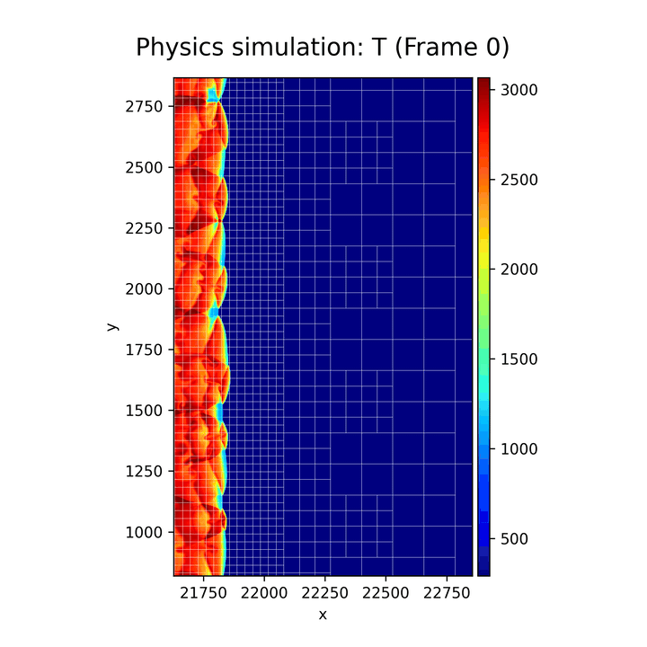

# WAMRViT

Adaptive Vision Transformer with quadtree-based adaptive patching for scientific spatiotemporal forecasting. Refines high-gradient regions, coarsens smooth ones.

## Visualization

### AMR

<table>
  <tr>
    <th></th>
    <th align="center">Model prediction</th>
    <th align="center">Ground truth</th>
  </tr>
  <tr>
    <th>HRR</th>
    <td></td>
    <td></td>
  </tr>
  <tr>
    <th>Pressure</th>
    <td></td>
    <td></td>
  </tr>
  <tr>
    <th>Density (ρ)</th>
    <td></td>
    <td></td>
  </tr>
  <tr>
    <th>Temperature</th>
    <td></td>
    <td></td>
  </tr>
</table>

Combustion trajectory, frame 330. Each row pairs the model's prediction with the ground truth at matching resolution.

---

## Install

```bash
uv sync
uv pip install -e .
```

Python ≥ 3.12.

## Status

Code-only release: configuration files, normalization data, and example
commands are not included in this revision.

## Layout

```
train.py                    Training entry point (Ray Tune + DDP)
wamrvit/
├── quadtree_transformer.py Adaptive quadtree ViT
├── swin_transformer.py     Regular-grid SwinV2 baseline
├── quad/                   Quadtree primitives and adaptation
├── dataloader/             Data loading, topology caching
├── rollout/                Autoregressive rollout, metrics
└── visualization/          Plotting utilities
```
